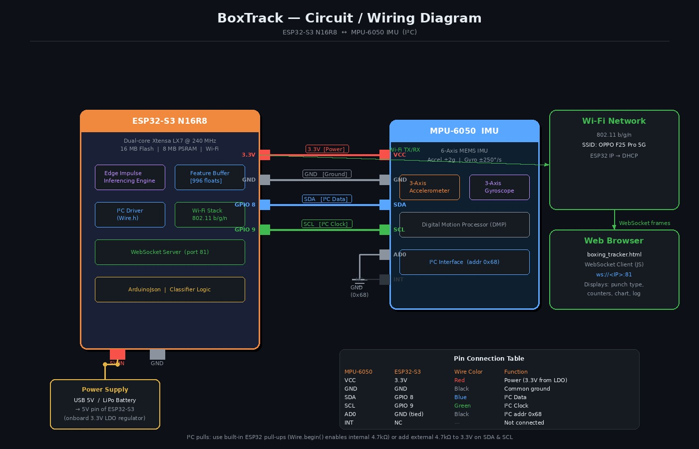

# BoxTrack – TinyML Boxing Move Detection

## Overview
A real-time motion classification system using ESP32-S3 and MPU-6050 IMU to detect boxing moves using TinyML. The system performs on-device inference with low latency and provides real-time visualization.

## Features
- Detects Jab, Hook, Uppercut, and Rest states
- On-device ML inference (no cloud dependency)
- Real-time WebSocket dashboard
- Low latency (~1 ms inference)

## Hardware Components
- ESP32-S3
- MPU-6050 IMU

## Tech Stack
ESP32-S3, Edge Impulse, TinyML, WebSockets

## Pipeline
Data Collection → Feature Extraction → Model Training → Embedded Deployment → Visualization

## Dataset
Custom IMU dataset collected using MPU-6050 for punch classification (Jab, Hook, Uppercut, Rest).

## System Workflow

## Circuit Diagram

## Results
- ~94% validation accuracy
- Real-time classification with low latency

## My Contribution
- Collected and labeled IMU dataset
- Trained TinyML model using Edge Impulse
- Deployed model on ESP32-S3
- Integrated system and validated performance

## Future Improvements
- Expand dataset for more gestures
- Improve model robustness
- Add mobile visualization interface
